

* The creator of the Shotokan project is Paul Gleeson from Code Institute.  The project aims to provide an introduction to Shotokan Karate and a beginner's guide to the martial art. In addition to this the site, individuals interested in learning more about Shotokan Karate can join a Shotokan Karate club.  

# Project Discription

### This project is for a karate school website that will have the following features:
* Registration: The site will allow sensei (teachers) to register new kyu(grade levels), studnents and sensei. The information collected will include the user's name, email address, address, date of birth, and grade to attain.
* Profile Cards: The registered users' information will be displayed in a card view. Each profile card can be edited or deleted by the teachers.
* Kyu Table: The site will also have a table to register Kyus (grade levels) in karate.
* Sensei Table: Another table will register the sensei (teachers) in the school.
* User Roles: Each user will be assigned a role as either a student or a teacher. Teachers will have access to new registrations, kyu registration, and sensei registration. This access will be provided through available navigation links and code that checks if the user is authenticated.
* Teacher Functionality: Teachers (sensei) will be able to edit and delete kyu, sensei, through user cards.
* Student Functionality: Students will have limited choices in the navigation bar and will only be able to view their own page. The student page will display their current attainable karate level and all previous grades. Students will not be able to edit any data in the project.
* Admin Panel: An admin account (superuser) will be created solely for access to the admin panel, where all the functionality of the site is included.

## Shotokan Karate

* [Ling to Shotokan github code](https://github.com/Shaga-Matula/Shotokan-Karate)
* [Link to Shotokan Heroku](https://shotokanapp-a0f46a26c73a.herokuapp.com/)

## README Table Content

1.  [Introduction](#Introduction)
    1.  [Project Introduction](#project-introduction)
    2.  [Login and Permisions](#login-and-permisions)
    3.  [Landing Page](#landing-page)
    4.  [Registration](#registration-process)
    5.  [MVP](#mvp)

2. [Shotokan Project](#Project-Goals)
    1.  [User experience](#User-experience)
    2.  [Agile Aproach](#Agile-Aproach)
    3.  [User Stories](#user-stories)

3.  [Design](#design)
    1.  [Design Landing Page](#landing-page)
    2.  [Description of the landing page](#description-of-the-landing-page)
    3.  [Design Student Registration Page](#student-registration-pagestudent-view-pagestudent-edit-page)
    4.  [Kyu Creation](#kyu-creation-pagekyu-edit-page)
    5.  [Sensei Creation Page](#sensei-creation-pagesensei-view-page-sensei-edit-page)

4. [DataBase Design](#database-design)
    1. [Normalizing definition](#normalizing-definition)
    2. [Pre-Normalizing](#pre-normalizing)
    3. [Over view of Shotkan Database](#over-view-of-shotkan-database)
    4. [Other Tables](#other-tables)

5. [Features](#features)
    1.  [Agile Aproach](#agile-aproach)
    2.  [User Stories](#user-stories)

6. [How to Use Shotokan Site](#how-to-use-shotokan-site)
    1.  [Registration form](#registration-form)
    2.  [Student Card View](#student-card-view)
    3.  [Student Update View](#student-update-view)
    4.  [Success](#success)
    5.  [Delete (Two-tier Validation Check)](#delete-two-tier-validation-check)
    6.  [Kyu Create](#kyu-create)
    7.  [Kyu View/Edit/Delete](#kyu-vieweditdelete)
    8.  [Kyu Update View](#kyu-update-view)
    9.  [Success](#success-1)
    10. [Delete (Two-tier Validation Check)](#delete-two-tier-validation-check-1)
    11. [Sensei Create](#sensei-create)
    12. [Sensei View/Edit/Delete](#sensei-vieweditdelete)
    13. [Success](#success-2)
    14. [Delete (Two-tier Validation Check)](#delete-two-tier-validation-check-2)
    15. [Student View (Restricted)](#student-view-restricted)

7.  [Technologies](#technologies)
    1. [Coding Languages](#coding-languages)
    2. [Technologies Used](#technologies-used)
    3. [Validation](#validation)
    4. [keyword, Discription(Meta)](#keyword-discriptionmeta)

8.  [Deployment](#deployment)
    1. [Version Control](#version-control)
    2. [Heroku](#heroku)
    3. [Creating Heroku App](#creating-heroku-app)
    4. [ElephantSql](#elephantsql)
    5. [env.py file](#envpy-file)
    6. [Cloudinary storage](#cloudinary-storage)
    7. [Setting Environment Variables](#setting-environment-variables)
    8. [Connecting to GitHub and Deploy](#connecting-to-github-and-deploy)
    9. [Forking the Repository](#forking-the-repository)
    10.[Making a Local Clone](#making-a-local-clone)

9. [Bugs](#bugs)

10.[Credits](#credits)

11.[Testing](#testing)

# Project Introduction

* The Shotokan website is designed to introduce potential karate students to Shotokan Karate as a means to achieve a healthier lifestyle and a healthy state of mind. The website aims to provide an engaging and informative experience for visitors. Shotokan Karate is a dynamic martial art style created by the late, great Gichin Funakoshi. The philosophy of Shotokan Karate is based on the traditional Budo (martial arts) spirit of Karate, which seeks the perfection of character through hard work and discipline. Shotokan Karate is a form of self-defense that is built on a strong foundation of physical and mental training.

## Login and permisions

* In this project, there are three types of users: admin (superuser), teachers, and students. Each user type has exclusive navbar access to specific functionalities and pages. Here's a breakdown of the access and functionalities for each user type:

### Admin (superuser):

- Test User name for admin : admin , "Htmlcss1" 
- Exclusive access to the admin panel.
- Can manage users, groups, and permissions in the admin panel.
- Can create and delete users in the admin panel.
- Can assign permissions to users or groups.

### Teachers:
- Test User Name for Sensei : Editor , "Bulmers1"
- Exclusive access to the website's functionality.
- Can create student profiles in the Registration Page.
- Can read student data from the Student View Page.
- Can update student data from the Student View Page.
- Can delete a student profile from the Student View Page.

### Students:

- Test User for Students DaveM "Htmlcss1"
- Exclusive access to their own information page.
- Cannot access or modify any students' information.

## Landing Page
* Upon visiting the website, the student is presented with a visually appealing landing page. The landing page features a hero image as background wallpaper that captures the essence of Shotokan Karate and immediately grabs the attention of the visitor. The navigation bar provides easy access to different sections of the website, allowing users to explore further. Additionally, a contact form is prominently displayed, enabling potential students to reach out for more information or inquiries.

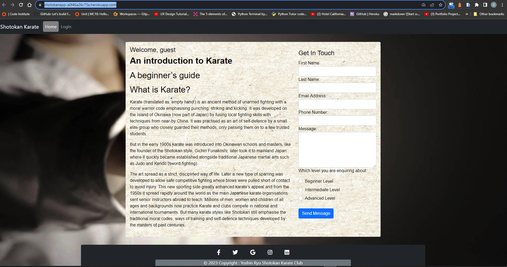

## Registration Process
* If a student decides to take up lessons, they can use the contact us form to express interest. If they choose to become students the head instructor can register through a form integrated into the website. This registration form is built using Django, along with Bootstrap for enhanced styling and responsiveness. The use of Django allows for efficient handling of form submissions and data management. The information provided by the student will be securely stored in a PostgreSQL database, ensuring the privacy and security of their personal details.
* Utilizing Django, Bootstrap and Python, the registration process is streamlined and user-friendly. The integration of these technologies enables a seamless user experience, making it easy for instructors to register students to sign up for lessons and become part of the Shotokan Karate community.
* The ultimate goal of the Shotokan website is to provide an engaging and informative platform that encourages potential students to explore the benefits of Shotokan Karate and take the first step towards a healthier lifestyle and a positive state of mind.

## MVP

* An MVP, or Minimum Viable Product, is a product development technique that involves creating a new product with just enough features to satisfy initial customers. The idea is to get the product to the market quickly, gather feedback, and improve it based on that feedback. The goal is to achieve a desirable product/market fit or determine if the product is non-viable. An MVP is a basic version of a new product with minimum essential features to satisfy the initial customers. It allows the team to gather the maximum amount of authentic learning about customers with little effort.

## Project Goals (MVP)

* Create a user-friendly MVP that provides a high-quality user experience. This includes implementing best practices for website design and development. By focusing on intuitive navigation, clear content presentation, and responsive design, to ensure that users have a positive and enjoyable experience while interacting with the website.
* Develop a form that effectively handles initial inquiries to the website. This form will be designed to capture relevant information from users and provide a seamless experience for submitting inquiries. By implementing HTML and CSS techniques, I will create a visually appealing and user-friendly form that encourages users to engage with the website.
* Utilize Agile methodology to organize the project, specifically by employing methods such as milestones (epics), and user stories. This approach will enable effective project management, allowing me to break down the project into manageable tasks and prioritize them based on user needs and project objectives.
* Improve website performance: This goal involves optimizing the website's speed and responsiveness to improve the user experience. By implementing best practices for website performance, such as optimizing images, reducing HTTP requests, and minifying code, I aim to ensure that users have a fast and seamless experience while interacting with the website.
* Enhance website security: This goal involves implementing security measures to protect user data and prevent hacking or other security breaches. By following best practices for website security, I aim to ensure that user data is secure and protected from potential threats.
* Increase website traffic: This goal involves implementing SEO strategies (Search Engine Optimization) and other marketing techniques to attract more visitors to the website. By following best practices for SEO such as using relevant keywords, creating high-quality content, I aim to increase the website's visibility and attract more visitors.
* Improve website accessibility: This goal involves making the website more accessible to users with disabilities, such as by adding alt text to images and ensuring that the website is compatible with screen readers. By following best practices for website accessibility, such as using semantic HTML, providing alternative text for images, and using ARIA attributes, we aim to ensure that all users can access and use the website.
* Enhance website design: This goal involves improving the overall look and feel of the website to make it more visually appealing and engaging for users. By following best practices for website design, such as using a consistent color scheme, using whitespace effectively, and using high-quality images, I will aim to create a website that is visually appealing and engaging for users.

# User experience

* Contact Page: The contact page should have a form that allows students to send messages to instructors and the school administration. 
* Home Page: The home page should have a clear and concise navigation menu that allows users to easily access different sections of the website. 
* Instructor Dashboard: The instructor dashboard should allow instructors to create, read, update, and delete information about students and their instructors. It should also allow them to view their progress. 
* Student Dashboard: The student dashboard should allow students to view their class grades and critical information for their next gradeing. 
* Grade Pages: Each class page should have a detailed description of the grade material, including the Kata name, and any prerequisites. 
* The Django admin panel should be tailored to function as a functional mirror of the website. This means that the admin panel should have the same features and functionalities as the website itself. By tailoring the admin panel to be a functioning copy of the website, administrators can easily navigate and make changes to the students without needing to access the website directly. This ensures consistency and ease of use for managing the website's backend operations.

# Design 

### Landing Page

* The landing page at provides an introduction to Karate and serves as a beginner's guide to the martial art. The page welcomes guests and highlights the key aspects of Karate. 

### Description of the landing page:

* Welcome message: The landing page greets the user as a guest.
* Introduction to Karate: The page introduces Karate as an ancient method of unarmed fighting with a moral warrior code. It emphasizes punching, striking, and kicking. Karate originated on the Island of Okinawa, which is now part of Japan. 
* Beginner's guide: The landing page mentions that it serves as a beginner's guide to Karate, providing essential information and insights for those new to the martial art.
* The landing page aims to provide visitors with a basic understanding of Karate and its principles. It serves as a starting point for individuals interested in learning more about the art and its techniques.
* Contact form: The contact form is an essential part of the landing page. It allows interested parties to contact the DoJo (School) with any questions or requests they might have or maybe take part and join the club. The form is well-designed, easy to use, and optimized for the visitor.

### Student Registration Page/Student View Page/Student Edit Page

* The form allows a Sensei to provide personal information for the student and register as a member of the karate school. The form is designed to be submitted using the POST method, which means that the user's information will be sent securely to the server for processing. In this form the instructor can apply grade level and assign students to the appropriate class and instructor.

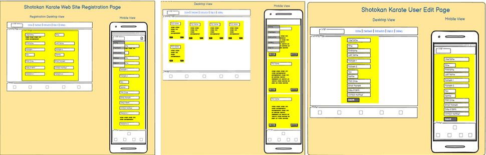

### Kyu Creation Page/Kyu Edit Page

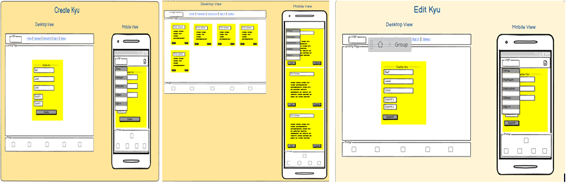

### Sensei Creation Page/Sensei View page /Sensei Edit Page

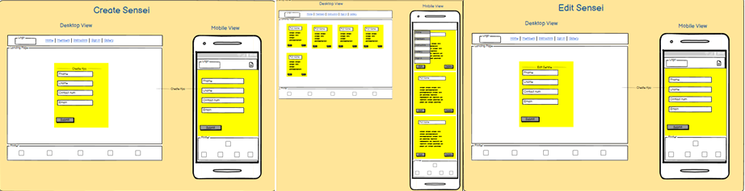

### DataBase Design

### Normalizing definition
* Normalizing a database table means organizing the information in a way that makes it easier to manage and prevents mistakes. In a database, we put similar information together in a table and make sure each piece of information is only stored in one place. This helps to avoid repeating information and makes it easier to update the information if needed. Normalizing a database makes it easier to manage and maintain, and it helps to avoid complexities and eliminate duplicates.

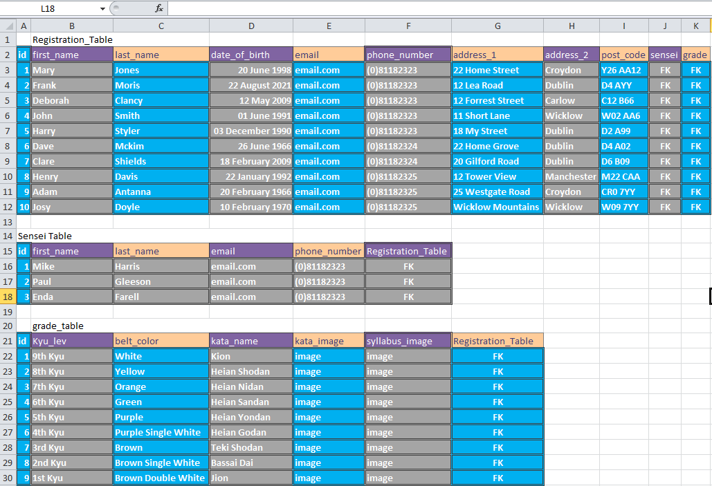

### Pre-Normalizing 
* This is the database table named "Students" before normalizing; it stores information about martial arts students. It has fields, including a primary key field "CustomerID" and also relevant data values, such as Varchar and Boolean. Please note this is a mock-up and tables and data values may change during design and implementation. 

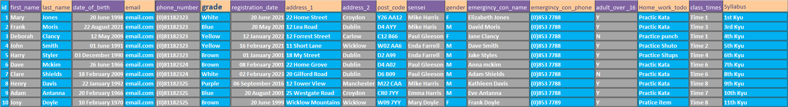

# Over view of Shotkan Database
* Role: A character field with a maximum length of 15, representing the role of the student.
* First Name: A character field with a maximum length of 50, representing the first name of the student.
* Last Name: A character field with a maximum length of 50, representing the last name of the student.
* Address Line One: A character field with a maximum length of 50, representing the first line of the student's address.
* Address Line Two: A character field with a maximum length of 50, representing the second line of the student's address. This field is optional and can be left blank.
* Date of Birth: A date field representing the date of birth of the student. This field is optional and can be left blank.
* Student Contact Number: A phone number field representing the contact number of the student. This field is optional and can be left blank.
* Last Update: A date and time field representing the last time the student profile was updated.
* Post Code: A character field with a maximum length of 10, representing the post code of the student's address.
* Email Address: An email field representing the email address of the student.
* Kyu To Achieve: A foreign key field representing the student's grade.
* Sensei: A foreign key field representing the student's sensei. This field is optional and can be left blank.

# Other Tables
*   The "Students_Table" is a database table that stores information about students. It has several columns that represent different attributes of a student, such as their ID, first name, last name, date of birth, email, address, postal code, role, last updated timestamp, student grade, and sensei.
*   The table also includes foreign key relationships to other tables, such as the "Student_Lvl" table and the "Sensei" table.
*   The "Student_Lvl" table stores information about the student's level, including the kyu level, belt color, kata name, kata image, and syllabus image.
*   The "Sensei" table stores information about the sensei, including their ID, first name, last name, email, and contact number.
*   Overall, the "Students_Table" provides a structured way to store and organize information about students, their levels, and their sensei. It allows for efficient retrieval  and manipulation of student data within a database system.

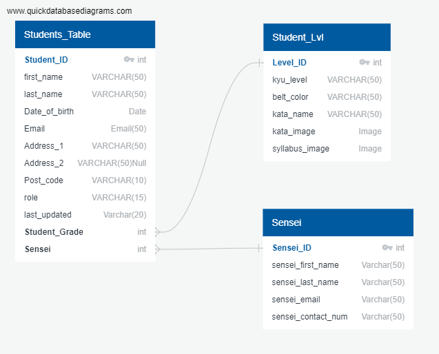

# Features

## Agile Aproach

* The Agile approach is a flexible project management methodology that emphasizes collaboration and iterative development. It is widely used in software development but can be applied to various industries and projects. The Agile approach focuses on delivering value to customers through incremental and frequent delivery of small chunks of functionality. One of the key components of the Agile approach is the use of user stories, which are short descriptions of what a user wants to achieve with a product or service. User stories follow a specific format: "As a [user], I want to [action], so that I [outcome]". The use of user stories helps to capture the user's perspective and prioritize work.

* In GitHub, labels are used to categorize issues and pull requests. They can help you keep track of what needs to be done and what's already been done. I have create some labels and used some of the default ones. Labels can be used to indicate the priority of an issue, the type of issue, or the status of an issue. For example, "bug", "enhancement", "high priority", "in progress", or "done".

## User Stories

* The user story template in this project is a widely used format for defining user requirements in Agile software development. The template follows the format of "As a [user], I want to [action], so that [outcome]". The template is used to capture user requirements in a concise and structured manner, making it easier for the development team to understand and implement them.
* The user story template in this project includes three sections: Estimation Effort, Tasks, and Acceptance Criteria. The Estimation Effort section uses the Fibonacci sequence to estimate the amount of effort required to complete each task. The Tasks section lists the specific tasks that need to be completed to achieve the user story. The Acceptance Criteria section lists the criteria that must be met for the user story to be considered complete.
* The use of the Fibonacci sequence in the Estimation Effort section is a common practice in Agile software development. The Fibonacci sequence is a numerical sequence in which each number is the sum of the two preceding numbers. The sequence is often used in Agile software development to estimate the amount of effort required to complete a task. The sequence is used because it allows for a more accurate estimation of effort, as it takes into account the uncertainty and complexity of software development.
* The user story template in this project is a useful tool for Agile software development teams. It provides a structured and concise format for capturing user requirements and helps to ensure that the development team understands and implements them correctly. By using this template, the development team can work more efficiently and effectively, resulting in a higher quality product that meets the needs of the users.

# How to Use Shotokan Site

* Navagate to the Shotokan Site using this link, [Link to Shotokan Heroku](https://shotokanapp-a0f46a26c73a.herokuapp.com/) and follow the instructions below.

## Registration form

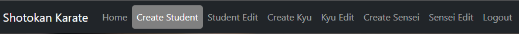

* In this project, the instructors are responsible for overseeing the student registration process. To begin, simply click on the "create student" tab located on the navigation bar, which will direct you to the registration page. Fill out all the necessary fields, including the student's first name, last name, address (both address_1 and address_2, although the latter is optional), date of birth (using the format dd/mm/yyyy), postal code, contact number, email address, sensei, student grade, and role.
* To ensure a unique identification for each student, choose a distinct user id and input it into the username field for the proposed student. If this userid is already taken a warning will be displayed and approiate action will need to be taken.  
* Enter the student's first name in the first_name field and their last name in the last_name field. Provide the student's address in the address_1 and address_2 fields, noting that the second address field is not compulsory. Input the student's date of birth in the date_of_birth field using the dd/mm/yyyy format. Include the student's postal code in the post_code field, contact number in the contact_num field, and email address in the email field.
* Next, select the appropriate role from the dropdown menu in the sensei, student_grade, and role fields. Finally, click the "submit" button to complete the registration process. If successful, you will be redirected to the success page

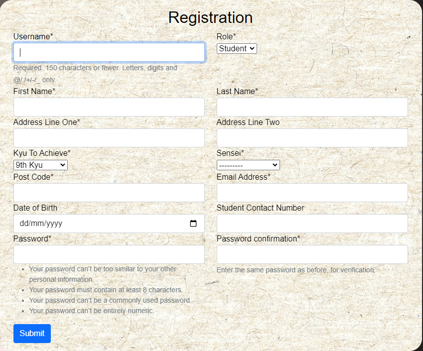

# Student Card View
* Each student is represented in a card view that clearly shows all the relevant student data such as Role, First Name, Last Name, Address Line One, Address Line Two, Date of Birth, Student Contact Number, Last Update, Post Code, Email Address, Kyu To Achieve, Sensei. From here, the teacher can read all necessary data on the students and also choose to update or delete the record. The record also has a last updated field to keep track of changes in the student profile. 
 
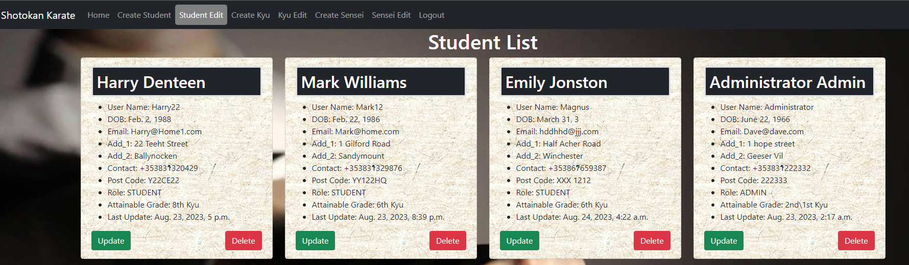

# Student Update View
* Here the student form includes all the necessary fields, such as Role, First Name, Last Name, Address Line One, Address Line Two, Date of Birth, Student Contact Number, Last Update, Post Code, Email Address, Kyu To Achieve, and Sensei. The fields are clearly presented and formatted to provide a user-friendly experience.
* To update a student record, the sensei can navigate to the student's profile and access the update form. The form will display all the existing data for each field, allowing the sensei to make any necessary changes. Once the sensei has made the desired updates, they can submit the form to save the changes to the student's record. The Last Update field will automatically be updated with the current date and time to keep track of the modifications made to the student profile.
* It is important to note that the Address Line Two field is optional and can be left blank if not applicable. The Kyu To Achieve and Sensei fields are foreign key fields, representing the student's grade and sensei, respectively. These fields can be updated by selecting the appropriate values from the provided options or by entering the necessary information.
* Overall, the form web page is designed to provide a seamless and efficient way for the sensei to update a student's record. The clear presentation and formatting of the fields ensure a user-friendly experience, making it easy for the sensei to make any necessary changes to the student's profile.

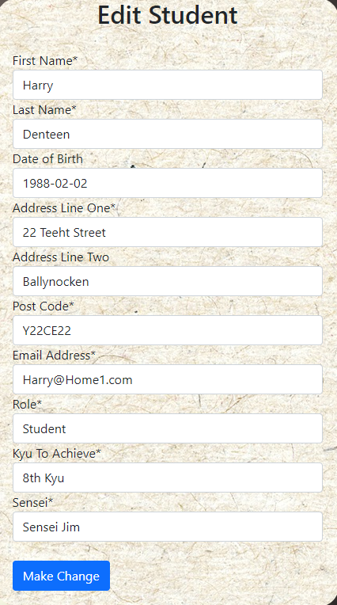

# Success

* If the user is successful in updating the record, they will be given a success message. This message will comprise of a page with the title "Success" that will provide URLs to any page they wish to go. This means that the user will be redirected to a page that confirms the successful update of the record and provides links to other pages that they may want to visit next. This can help the user navigate the website more easily and efficiently.

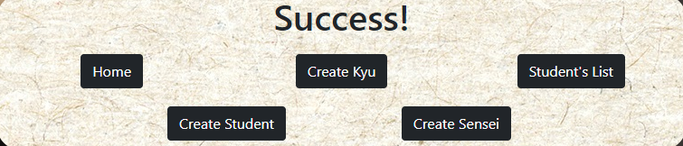

# Delete (Two-tier Validation Check)
* First check: If the sensei clicks the delete button, they will be presented with a choice of "yes" or "no". They will also see a clear view of the student's name and record ID because deletion is irreversible. If the user clicks "delete", the program will ask for a second check.
* Second check: The user is presented with a Django Allauth message asking them to confirm if they want to delete the record.
* This two-tier validation check ensures that the deletion process is deliberate and helps prevent accidental deletions. The first check provides a clear view of the student's information, allowing the sensei to review it before making a decision. The second check, using Django Allauth, adds an extra layer of confirmation to ensure that the user is certain about deleting the record.
* By implementing this two-tier validation check, you can enhance the user experience and minimize the risk of unintended deletions.

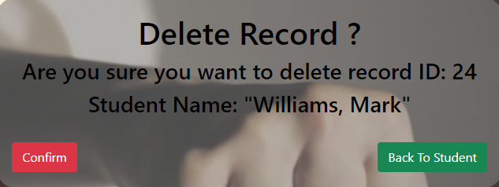
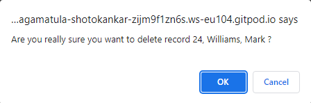

# Kyu Create

-  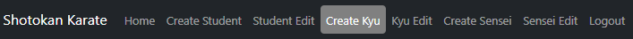

* Fill in the form given in the code, follow these steps:
* Open the HTML file in a web browser.
* Fill in the form fields with the required information.
* Select the Submit button to submit the form.

- The form contains the following input fields:
- kyu_level: Select the kyu level from the dropdown list.
- belt_color: Select the belt color from the dropdown list.
- kata_name: Enter the name of the kata in the text field.
- Kata_image: Upload an image of the kata to cloudaniry.
- Syllabus_image: Upload an image of the syllabus to cloudaniry.
- Make sure to include all the required information in the form before submitting it. The form also includes a CSRF token to safeguard against attacks.

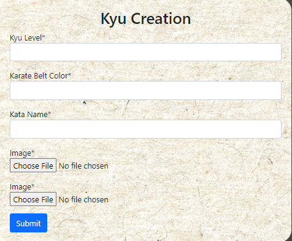

# Kyu View/Edit/Delete

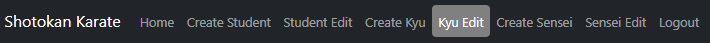

* When the relevant navigation button is selected, the Kyu (grade) levels are displayed. It is important to note that while this view is relatively static and does not require editing, some Dojos (Schools) may have a different grading system that could result in changes to the syllabus and grade colors.

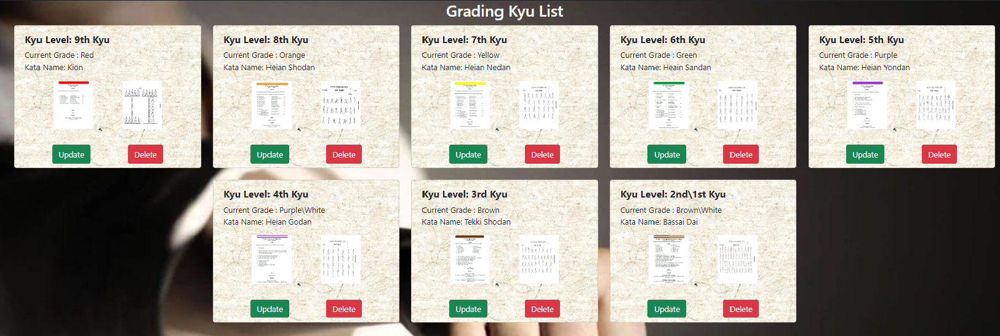

# Kyu Update View

* Here the Kyu form includes all the necessary fields, such as Kyu Name, Belt Color, Kata Name, Kata Image and Syllabus Image. The fields are clearly presented and formatted to provide a user-friendly experience.
* To update a Kyu Level, the sensei can navigate to the Kyu Profile and access the update form. The form will display all the existing data for each field, allowing the sensei to make any necessary changes. Once the sensei has made the desired updates, they can submit the form to save the changes to the student's record. 

* It is important to note that the Kata Image and Syllabus image are saved to cloudinary. These fields can be updated by selecting the appropriate values from the provided options or by entering the necessary information.
* Overall, the form web page is designed to provide a seamless and efficient way for the sensei to update a Kyu record. The clear presentation and formatting of the fields ensure a user-friendly experience, making it easy for the sensei to make any necessary changes to the Kyu records.

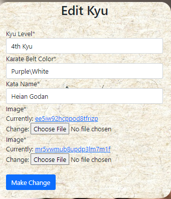

# Success

* If the user is successful in updating the record, they will be given a success message. This message will comprise of a page with the title "Success" that will provide URLs to any page they wish to go. This means that the user will be redirected to a page that confirms the successful update of the record and provides links to other pages that they may want to visit next. This can help the user navigate the website more easily and efficiently.

# Delete (Two-tier Validation Check)
* First check: If the sensei clicks the delete button, they will be presented with a choice of "yes" or "no". They will also see a clear view of the student's name and record ID because deletion is irreversible. If the user clicks "delete", the program will ask for a second check.
* Second check: The user is presented with a Django Allauth message asking them to confirm if they want to delete the record.
* This two-tier validation check ensures that the deletion process is deliberate and helps prevent accidental deletions. The first check provides a clear view of the student's information, allowing the sensei to review it before making a decision. The second check, using Django Allauth, adds an extra layer of confirmation to ensure that the user is certain about deleting the record.
* By implementing this two-tier validation check, you can enhance the user experience and minimize the risk of unintended deletions.

# Sensei Create

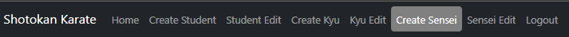

* To fill in the form provided in the code snippet, follow these steps:
* Open the HTML file in a web browser.
-   Fill in the form fields with the required information.
-   sensei_first_name: Enter the first name of the sensei in the text field.
-   sensei_last_name: Enter the last name of the sensei in the text field.
-   sensei_email: Enter the email address of the sensei in the text field.
-   sensei_contact_num: Enter the contact number of the sensei in the text field.
-   Select the Submit button to submit the form.
*   Make sure to include all the required information in the form before submitting it. The form also includes a CSRF token to safeguard against attacks.

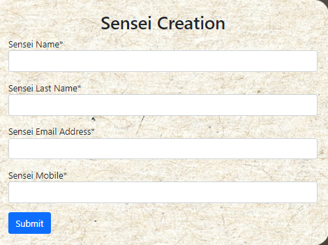

# Sensei View/Edit/Delete

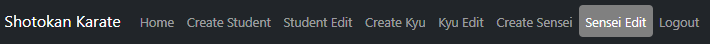

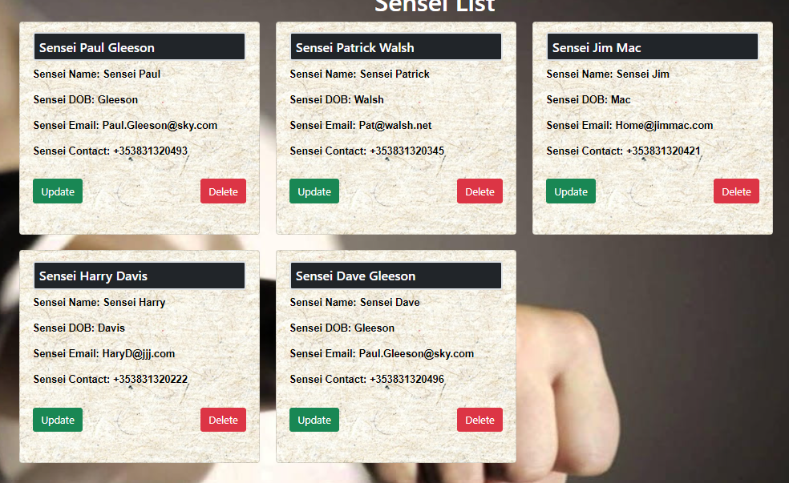

* Here the Sensei form includes all the necessary fields, such as Semsei first name, Sensei last name, Email and Contact number. The fields are clearly presented and formatted to provide a user-friendly experience.
* To update a Sensei, the editor can navigate to the Sensei Profile and access the update form. The form will display all the existing data for each field, allowing the sensei to make any necessary changes. Once the sensei has made the desired updates, they can submit the form to save the changes to the sensei record. 
* Overall, the form web page is designed to provide a seamless and efficient way for the sensei to update a Sensei record. The clear presentation and formatting of the fields ensure a user-friendly experience, making it easy for the sensei to make any necessary changes to the Sensei records.

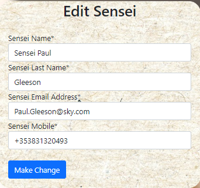

# Success

* If the user is successful in updating the record, they will be given a success message. This message will comprise of a page with the title "Success" that will provide URLs to any page they wish to go. This means that the user will be redirected to a page that confirms the successful update of the record and provides links to other pages that they may want to visit next. This can help the user navigate the website more easily and efficiently.

# Delete (Two-tier Validation Check)
* First check: If the sensei clicks the delete button, they will be presented with a choice of "yes" or "no". They will also see a clear view of the student's name and record ID because deletion is irreversible. If the user clicks "delete", the program will ask for a second check.
* Second check: The user is presented with a Django Allauth message asking them to confirm if they want to delete the record.
* This two-tier validation check ensures that the deletion process is deliberate and helps prevent accidental deletions. The first check provides a clear view of the student's information, allowing the sensei to review it before making a decision. The second check, using Django Allauth, adds an extra layer of confirmation to ensure that the user is certain about deleting the record.
* By implementing this two-tier validation check, you can enhance the user experience and minimize the risk of unintended deletions.

# Student View (Restricted)
-   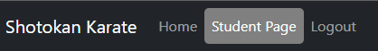

- When a student logs in, they will have limited access to their previous grade material and attainable grade information. This means that if a student's attainable grade is 6th kyu, they will have access to the material for 9th, 8th, and 7th grades as well. It is important to note that the grades go from lowest to highest, with 9th grade being the lowest (Yellow belt) and 1st kyu being the highest (brown 2 white stripes).

-   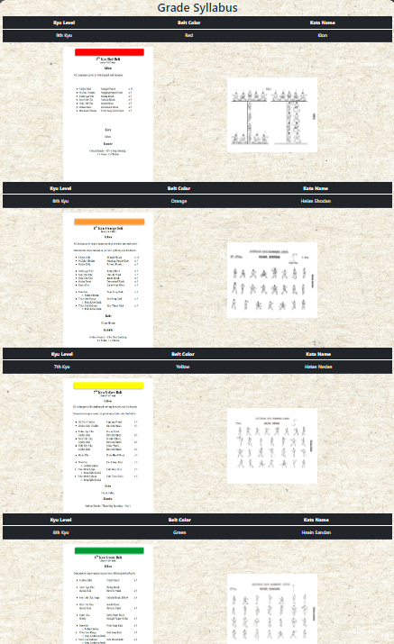

# Technologies

## Coding Languages
* HTML
* CSS
* Python 3
* Javascript

## Technologies Used
* Git - Version control system.
* GitHub - Managing Git repositories.
* Gitpod - Development environment.
* Icon library for producing icons on websites.
* Google Fonts - Collection of free, open-source fonts for importing into websites.
* Psycopg2 - PostgreSQL adapter for Python.
* Django 3.2.16 - A Python web framework for rapid development.
* Gunicorn - Python HTTP server for WSGI applications.
* Heroku Platform - A cloud-based platform for deploying and managing web applications.
* Crispy Forms - A Python package for formatting forms in Django.
* Website Mockup Generator - A tool for creating mockups of websites on different screen sizes.
* Balsamiq - A wireframing tool for producing mockups of websites.
* Bootstrap 5 - A front-end framework for building responsive websites.
* Cloudinary - A cloud-based image and video management platform for storing media assets.
* Microsoft Paint - Editor for images
* Microsoft Word 2010
* Responsinator 
* QuickDBD 

## Validation
* WC3 Validator - Used to validate the HTML code of the site.
* Jigsaw W3 Validator- Used to validate the CSS of the site.
* Jshint - Used to validate the Javascript of the site.
* Pycodestyle - Used to validate code against Python conventions.
* Chrome dev tools (Lighthouse) - Used to measure site performance, SEO and accessibility.
* WAVE Validator - Used to evaluate site accessibility

## keyword, Discription(Meta)
*   Site Discription="Shotokan Karate club for people in Dublin, Ireland"
*   keywords search="Shotokan Karate, Karate club, Martial arts, Self-defense, Kata, Kumite, Dojo, Sensei, Training, Techniques, Belt ranking, Sparring, Japan, Dublin, Ireland"

## Deployment

## Version Control
- The Site was created using gitpod workspace and pushed to github.
- git add . - This command was used to add the file(s) to the staging area before they are committed.
- git commit -m “commit message” - This command was used to commit changes to the local repository queue ready for the final step.
- git push - This command was used to push all committed code to the repository on github.

## Heroku 

- Requirement and Procfile
- Before deployment on Heroku, two files need to be created and be up to date, a requirements.txt file and a Procfile.
- The requirements.txt file is created by executing the following command in the terminal window:  pip3 freeze --local > requirements.txt. A file with all requirements will be  created.
- Then create a file named Procfile and insert the following code: web: gunicorn welovedogs.wsgi, with no empty lines after it.
- Then make sure to push these files to your repository.

## Creating Heroku App

- Log into Heroku and go to the Dashboard.
- Click "New" and then select "Create new app".
- Give your app a name and select the region closest to you.
- Click "Create app" to confirm.
- Creating a database

## ElephantSql

- Log into ElephantSQL.com and access your dashboard.
- Click "Create New Instance"
- Set up a plan, give your plan a Name, select the Tiny Turtel (Free) plan, leave the Tags field blank.
- Select "Select Region" and select a data center new you.
- Click "Review".
- Confirm your details and then click "Create instance".
- Return to the ElephantSQL dashboard and click on the database instance name for this project.
- In the URL section, click the copy icon to copy the database URL.
- In your workspace make sure django and gunicorn are installed by running pip3 install 'django<4' gunicorn.
- Equally make sure that infrastructure for the database is installed by running pip3 install dj_database_url===0.5.0 psycopg2.
- Update the requirements.txt file if needed.

## env.py file

- If you do not have a env.py file in your workspace create one and make sure it is included in the .gitignore file.
- At the top of the env.py file add the line: import os.
- Below that add the following two lines:
- os.environ["DATABASE_URL"] = "<copied URL from SQL database>"
- os.environ["SECRET_KEY"] = "<create a secret key of your own>"

## Cloudinary storage:

- os.environ["CLOUDINARY_URL"] = "<copied URL from Cloudinary account>"
- Make sure the environment variables are imported correctly into the settings.py file.
- Run python manage.py migrate in the terminal window to migrate the data structure to the database instance.

## Setting Environment Variables

- On the Heroku Dashboard select the app you just created and then select the "Settings" tab.
- Click "Reveal Config Vars"
- Add the following config vars:
    - DATABASE_URL - copy the database URL from ElephantSQL in here, it should also be in the env.py file.
    - SECRET_KEY - copy your secret key in here.
    - Cloudinary storage you also need to copy your personal CLOUDINARY_URL into these fields.
    - In addition, you may need the key PORT with value 8000.

## Connecting to GitHub and Deploy

- On the Heroku Dashboard select the app you just created and then select the "Deploy" tab.
- Select GitHub for the deployment method.
- Search for the name of the project repository and click "Connect".
- Further down the page, select "Enable Automatic Deploys" if desired.
- Then finally further down, select "Deploy Branch" and watch the app being built.

## Forking the Repository
- Log in to GitHub and locate the GitHub repository you want to fork.
- At the top of the Repository above the "Settings" Tab on the menu, locate the "Fork" Button and click it.
- You will have a copy of the original repository in your GitHub account.
- You will now be able to make changes to the new version and keep the original safe.

## Making a Local Clone
- Log into GitHub and locate the repository you want to clone.
- Click the 'Code' dropdown above the file list.
- Copy the URL for the repository.
- Open Git Bash in your IDE.
- Change the current working directory to the location where you want the cloned directory.
- Type git clone in the CLI and then paste the URL you copied earlier. This is what it should look like: $ git clone https://github.com/
- Press Enter to create your local clone.
- Install all of the packages listed in the requirements file you can use the following command in the terminal pip install -r requirements.txt which will do it for you.

## Bugs

### Heroku Error

* Issue :  Css and Static not working on Heroku
    1. Check all settings in Heroku :  All good no errors found.
    2. Check Paths in CSS HTML and Static
    3. Research on Stack Over flow
    4. Install White noise.  

- Fix: White Noise need to be fully installed not just pip install. Enterys wre needed in Settings.py

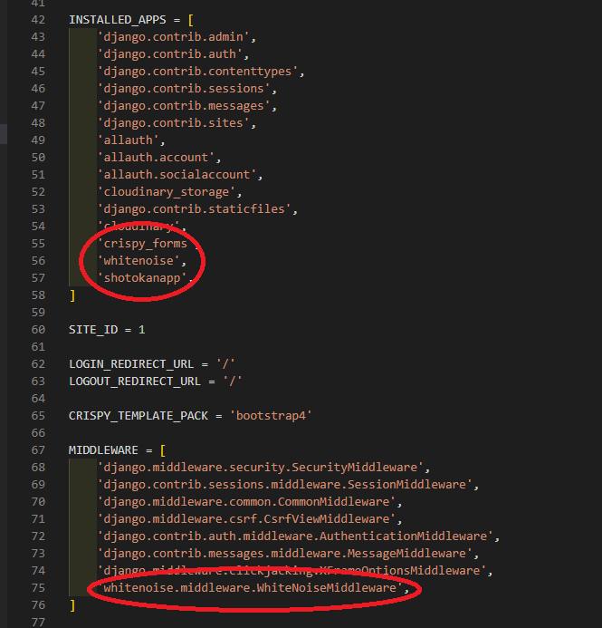

### Deceptive Site Ahead
* Issue: Decptive Site Ahead 

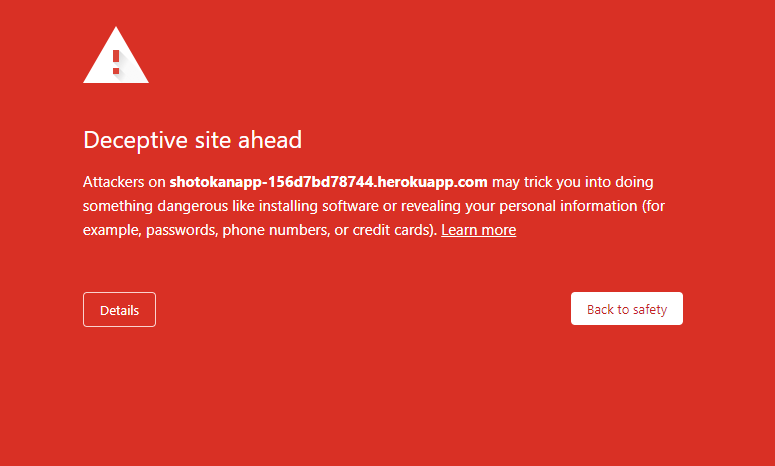

1.  Upon contacting Heroku, it was confirmed that there were no issues with the site.
2.  A search for Mallish software or links on the site yielded no results.
3.  After recreating the Heroku site, a warning was noticed on the site link.

- Fix: 
- Some user passwords were listed on a blacklist.
- Deleted affected user accounts.
- Created new users and passwords for those users.

### Cant access Admin Panel after creating custom user. 
* Issue : Error message  
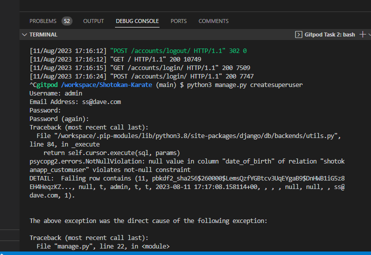

- AUTH_USER_MODEL = 'shotokanapp.CustomUser'
- fix by https://testdriven.io/blog/django-custom-user-model/

### Vulnerability

- There is a vulnerability where anonymous users can access restricted pages by pasting the URL into the search bar. To mitigate this security risk, we have implemented the use of "UserPassesTestMixin" and added a small code snippet to each view.
- This approach ensures that only authorized users can access the restricted areas, preventing unauthorized access and maintaining the integrity of the application.
- In the event that access or authentication is denied, the user will be redirected to the login screen. This ensures that only authorized users can access the application and maintain the security of the system.

-   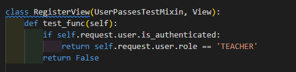

-   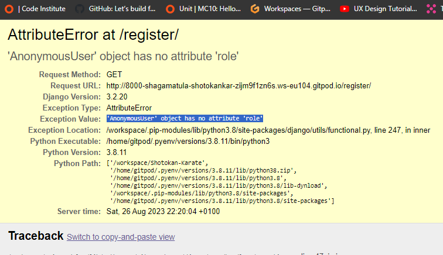

# Credits

-   The project is dedicated to the memory of Sensei Gichin Funakoshi https://en.wikipedia.org/wiki/Gichin_Funakoshi and Sensai Erol Fields.
-   All Karate information and images were created by Paul Gleeson, written in 2016 in a book called [Yoshin Ryu](https://www.yoshinryu.co.uk/) 
 Karate Syllabus. I have full permision from Yoshin Ryu Karare Club Cousldon UK to use any material nessasary.

# Testing