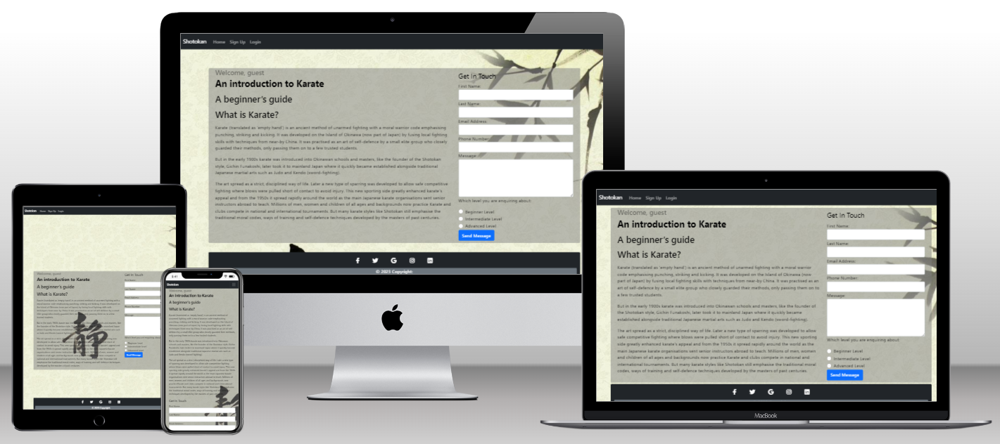
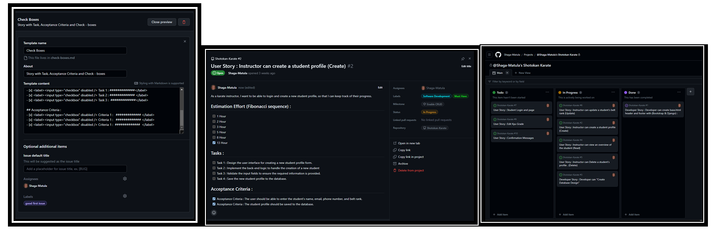

* https://shields.io/badges

* The creator of the Shotokan project is Paul Gleeson from Code Institute. The project is dedicated to the memory of Sensei Gichin Funakoshi https://en.wikipedia.org/wiki/Gichin_Funakoshi and Sensai Erol Fields. The project aims to provide an introduction to Shotokan Karate and a beginner's guide to the martial art. In addition to this the site, individuals interested in learning more about Shotokan Karate can join a Shotokan Karate club. All Karate information and images were created by Paul Gleeson, written in 2016 in a book called Yoshin Ryu Karate Syllabus. I have full permision from Yoshin Ryu Karare Club Cousldon UK to use any material nessasary. 
[Yoshin Ryu](https://www.yoshinryu.co.uk/) 

# Shotokan Karate

* [Ling to Shotokan github code](https://github.com/Shaga-Matula/Shotokan-Karate)
* [Link to Shotokan Heroku](https://shotokanapp-156d7bd78744.herokuapp.com/)

# Project Introduction

* The Shotokan website is designed to introduce potential karate students to Shotokan Karate as a means to achieve a healthier lifestyle and a healthy state of mind. The website aims to provide an engaging and informative experience for visitors. Shotokan Karate is a dynamic martial art style created by the late, great Gichin Funakoshi. The philosophy of Shotokan Karate is based on the traditional Budo (martial arts) spirit of Karate, which seeks the perfection of character through hard work and discipline. Shotokan Karate is a form of self-defense that is built on a strong foundation of physical and mental training.

## Landing Page
* Upon visiting the website, the student is presented with a visually appealing landing page. The landing page features a hero image as background wallpaper that captures the essence of Shotokan Karate and immediately grabs the attention of the visitor. The navigation bar provides easy access to different sections of the website, allowing users to explore further. Additionally, a contact form is prominently displayed, enabling potential students to reach out for more information or inquiries.
## Registration Process
* If a student decides to take up lessons, they can use the contact us form to express interest. If they choose to become students the head instructor can register through a form integrated into the website. This registration form is built using Django, along with Bootstrap for enhanced styling and responsiveness. The use of Django allows for efficient handling of form submissions and data management. The information provided by the student will be securely stored in a PostgreSQL database, ensuring the privacy and security of their personal details.
* Utilizing Django, Bootstrap and Python, the registration process is streamlined and user-friendly. The integration of these technologies enables a seamless user experience, making it easy for instructors to register students to sign up for lessons and become part of the Shotokan Karate community.
* The ultimate goal of the Shotokan website is to provide an engaging and informative platform that encourages potential students to explore the benefits of Shotokan Karate and take the first step towards a healthier lifestyle and a positive state of mind.

## README Table Content

1.  [Introduction](#Introduction)
    1.  [Project Goals](#Project-Goals)
    2.  [User experience](#User-experience)
    3.  [Agile Aproach](#Agile-Aproach)
    4.  [User Stories](#user-stories)
    5.  [Design](#design)

## MVP

* An MVP, or Minimum Viable Product, is a product development technique that involves creating a new product with just enough features to satisfy initial customers. The idea is to get the product to the market quickly, gather feedback, and improve it based on that feedback. The goal is to achieve a desirable product/market fit or determine if the product is non-viable. An MVP is a basic version of a new product with minimum essential features to satisfy the initial customers. It allows the team to gather the maximum amount of authentic learning about customers with little effort.

## Project Goals (MVP)

* Create a user-friendly website that provides a high-quality user experience. This includes implementing best practices for website design and development. By focusing on intuitive navigation, clear content presentation, and responsive design, I aim to ensure that users have a positive and enjoyable experience while interacting with the website.
* Develop a form that effectively handles initial inquiries to the website. This form will be designed to capture relevant information from users and provide a seamless experience for submitting inquiries. By implementing HTML and CSS techniques, I will create a visually appealing and user-friendly form that encourages users to engage with the website.
* Utilize Agile methodology to organize the project, specifically by employing methods such as milestones (epics), and user stories. This approach will enable effective project management, allowing me to break down the project into manageable tasks and prioritize them based on user needs and project objectives. By using Agile, I can ensure a collaborative and iterative development process that aligns with the dynamic nature of the project.
* Improve website performance: This goal involves optimizing the website's speed and responsiveness to improve the user experience. By implementing best practices for website performance, such as optimizing images, reducing HTTP requests, and minifying code, I aim to ensure that users have a fast and seamless experience while interacting with the website.
* Enhance website security: This goal involves implementing security measures to protect user data and prevent hacking or other security breaches. By following best practices for website security, I aim to ensure that user data is secure and protected from potential threats.
* Increase website traffic: This goal involves implementing SEO strategies (Search Engine Optimization) and other marketing techniques to attract more visitors to the website. By following best practices for SEO such as using relevant keywords, creating high-quality content, I aim to increase the website's visibility and attract more visitors.
Improve website accessibility: This goal involves making the website more accessible to users with disabilities, such as by adding alt text to images and ensuring that the website is compatible with screen readers
* By following best practices for website accessibility, such as using semantic HTML, providing alternative text for images, and using ARIA attributes, we aim to ensure that all users can access and use the website.
* Enhance website design: This goal involves improving the overall look and feel of the website to make it more visually appealing and engaging for users. By following best practices for website design, such as using a consistent color scheme, using whitespace effectively, and using high-quality images, we aim to create a website that is visually appealing and engaging for users.

# User experience

* Contact Page: The contact page should have a form that allows students to send messages to instructors and the school administration. 
* Home Page: The home page should have a clear and concise navigation menu that allows users to easily access different sections of the website. 
* Instructor Dashboard: The instructor dashboard should allow instructors to create, read, update, and delete information about students and their instructors. It should also allow them to view their progress. 
* Student Dashboard: The student dashboard should allow students to view their class grades and critical information for their next gradeing. 
* Grade Pages: Each class page should have a detailed description of the grade material, including the Kata name, and any prerequisites. 
* The Django admin panel should be tailored to function as a functional mirror of the website. This means that the admin panel should have the same features and functionalities as the website itself. By tailoring the admin panel to be a functioning copy of the website, administrators can easily navigate and make changes to the students without needing to access the website directly. This ensures consistency and ease of use for managing the website's backend operations.

# Design 

### Landing Page

* The landing page at provides an introduction to Karate and serves as a beginner's guide to the martial art. The page welcomes guests and highlights the key aspects of Karate. 

### Description of the landing page:

* Welcome message: The landing page greets the user as a guest.
* Introduction to Karate: The page introduces Karate as an ancient method of unarmed fighting with a moral warrior code. It emphasizes punching, striking, and kicking. Karate originated on the Island of Okinawa, which is now part of Japan. 
* Beginner's guide: The landing page mentions that it serves as a beginner's guide to Karate, providing essential information and insights for those new to the martial art.
* The landing page aims to provide visitors with a basic understanding of Karate and its principles. It serves as a starting point for individuals interested in learning more about the art and its techniques.
* Contact form: The contact form is an essential part of the landing page. It allows interested parties to contact the DoJo (School) with any questions or requests they might have or maybe take part and join the club. The form is well-designed, easy to use, and optimized for the visitor.

### Student Registration Page/Student View Page/Student Edit Page

* The form allows a Sensei to provide personal information for the student and register as a member of the karate school. The form is designed to be submitted using the POST method, which means that the user's information will be sent securely to the server for processing. In this form the instructor can apply grade level and assign students to the appropriate class and instructor.

### Kyu Creation Page/Kyu Edit Page

### DataBase Design

### Normalizing definition
* Normalizing a database table means organizing the information in a way that makes it easier to manage and prevents mistakes. In a database, we put similar information together in a table and make sure each piece of information is only stored in one place. This helps to avoid repeating information and makes it easier to update the information if needed. Normalizing a database makes it easier to manage and maintain, and it helps to avoid complexities and eliminate duplicates.

### Pre-Normalizing 
* This is the database table named "Students" before normalizing; it stores information about martial arts students. It has fields, including a primary key field "CustomerID" and also relevant data values, such as Varchar and Boolean. Please note this is a mock-up and tables and data values may change during design and implementation. 

### Over view of Shotkan Database

*   The "Students_Table" is a database table that stores information about students.
    It has several columns that represent different attributes of a student, such as their ID, first name, last name, date of birth, email, address, postal code, role, last updated timestamp, student grade, and sensei.
*   The table also includes foreign key relationships to other tables, such as the "Student_Lvl" table and the "Sensei" table.
*   The "Student_Lvl" table stores information about the student's level, including the kyu level, belt color, kata name, kata image, and syllabus image.
*   The "Sensei" table stores information about the sensei, including their ID, first name, last name, email, and contact number.
*   Overall, the "Students_Table" provides a structured way to store and organize information about students, their levels, and their sensei. It allows for efficient retrieval  and manipulation of student data within a database system.

# Features

## Agile Aproach

* The Agile approach is a flexible project management methodology that emphasizes collaboration and iterative development. It is widely used in software development but can be applied to various industries and projects. The Agile approach focuses on delivering value to customers through incremental and frequent delivery of small chunks of functionality. One of the key components of the Agile approach is the use of user stories, which are short descriptions of what a user wants to achieve with a product or service. User stories follow a specific format: "As a [user], I want to [action], so that I [outcome]". The use of user stories helps to capture the user's perspective and prioritize work.

* In GitHub, labels are used to categorize issues and pull requests. They can help you keep track of what needs to be done and what's already been done. I have create some labels and used some of the default ones. Labels can be used to indicate the priority of an issue, the type of issue, or the status of an issue. For example, "bug", "enhancement", "high priority", "in progress", or "done".

## User Stories

* The user story template in this project is a widely used format for defining user requirements in Agile software development. The template follows the format of "As a [user], I want to [action], so that [outcome]". The template is used to capture user requirements in a concise and structured manner, making it easier for the development team to understand and implement them.
* The user story template in this project includes three sections: Estimation Effort, Tasks, and Acceptance Criteria. The Estimation Effort section uses the Fibonacci sequence to estimate the amount of effort required to complete each task. The Tasks section lists the specific tasks that need to be completed to achieve the user story. The Acceptance Criteria section lists the criteria that must be met for the user story to be considered complete.
* The use of the Fibonacci sequence in the Estimation Effort section is a common practice in Agile software development. The Fibonacci sequence is a numerical sequence in which each number is the sum of the two preceding numbers. The sequence is often used in Agile software development to estimate the amount of effort required to complete a task. The sequence is used because it allows for a more accurate estimation of effort, as it takes into account the uncertainty and complexity of software development.
* The user story template in this project is a useful tool for Agile software development teams. It provides a structured and concise format for capturing user requirements and helps to ensure that the development team understands and implements them correctly. By using this template, the development team can work more efficiently and effectively, resulting in a higher quality product that meets the needs of the users.

# Technologies Used

# Deployment and Local Development

# Testing

# Credits

# Registration form

* In this project, the instructors are responsible for overseeing the student registration process. To begin, simply click on the "create student" tab located on the navigation bar, which will direct you to the registration page. Fill out all the necessary fields, including the student's first name, last name, address (both address_1 and address_2, although the latter is optional), date of birth (using the format dd/mm/yyyy), postal code, contact number, email address, sensei, student grade, and role.
* To ensure a unique identification for each student, choose a distinct user id and input it into the username field for the proposed student. If this userid is already taken a warning will be displayed and approiate action will need to be taken.  
* Enter the student's first name in the first_name field and their last name in the last_name field. Provide the student's address in the address_1 and address_2 fields, noting that the second address field is not compulsory. Input the student's date of birth in the date_of_birth field using the dd/mm/yyyy format. Include the student's postal code in the post_code field, contact number in the contact_num field, and email address in the email field.
* Next, select the appropriate role from the dropdown menu in the sensei, student_grade, and role fields. Finally, click the "submit" button to complete the registration process. If successful, you will be redirected to the success page

## Tools
### Responsinator :-   http://www.responsinator.com/?url=https%3A%2F%2F8000-shagamatula-pgcipp4-wgmitq7ua1e.ws-eu101.gitpod.io%2F
### QuickDBD : -       https://app.quickdatabasediagrams.com

## Bugs

### Cant access Admin Panel after creating custom user. 
* Issue : Error message  

* AUTH_USER_MODEL = 'shotokanapp.CustomUser'
* fix by https://testdriven.io/blog/django-custom-user-model/

## Login and permisions

* In this project, there are three types of users: admin (superuser), teachers, and students. Each user type has exclusive navbar access to specific functionalities and pages. Here's a breakdown of the access and functionalities for each user type:

### Admin (superuser):

- Exclusive access to the admin panel.
- Can manage users, groups, and permissions in the admin panel.
- Can create and delete users in the admin panel.
- Can assign permissions to users or groups.

### Teachers:

- Exclusive access to the website's functionality.
- Can create student profiles in the Registration Page.
- Can read student data from the Student View Page.
- Can update student data from the Student View Page.
- Can delete a student profile from the Student View Page.

### Students:

- Exclusive access to their own information page.
- Cannot access or modify any students' information.